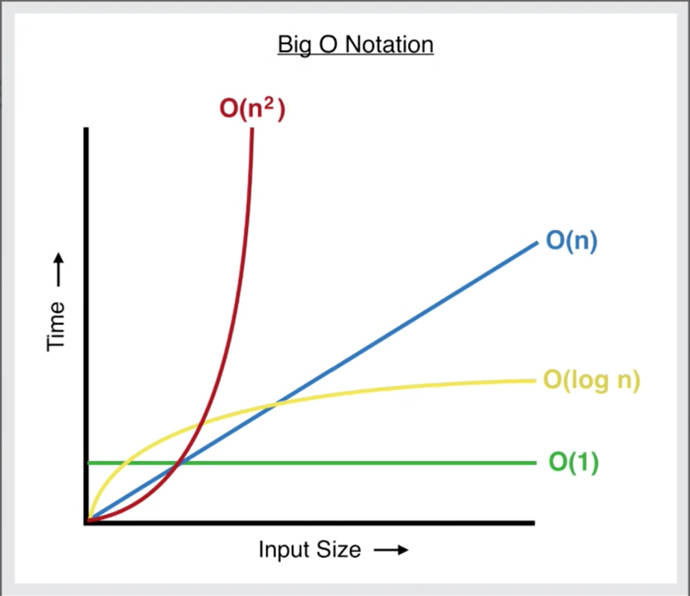

# Big (O) notation - Data Structures & Algorithms

Big O notation is the way to measure how software program's running time or space requirements grow as the input size grows. We can't measure this using absolute terms such as time in seconds because different computers have different hardware hence we need a mathematical way to measure time complexity of a program and Big O is that mathematical way. The basic idea is to come up with mathematical function for a running time and consider only fastest growing term and discard other terms as well as constants. Big O is used to measure space complexity as well, You will know how to find the time and space complexity of algorithms.

Some of the lists of common computing times of algorithms in order of performance are as follows:

- O (1) /Constant Time
- O (log n)/Logarithmic time
- O (n)/ linear Time
- O (nlog n)
- O (n2)/Quadratic Time
- O (n3)
- O (2n)
  Thus algorithm with their computational complexity can be rated as per the mentioned order of performance.

  ## Big O Notation depends only on the algorithm, not the hardware used to run the algorithm

### (n) represents the number of inputs
